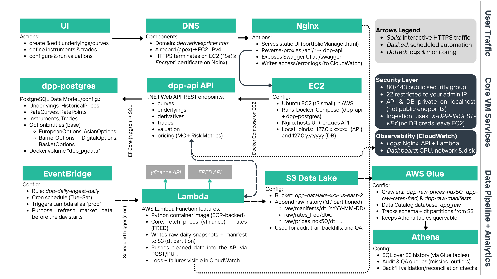

# Derivatives Portfolio Pricer

An open-source, full-stack derivatives portfolio valuation platform deployed on AWS. It combines a browser-based UI, an ASP.NET pricing API, a PostgreSQL database, and an automated market-data pipeline to value portfolios of classical and exotic options using Monte Carlo simulation.

**Live demo:** [derivativespricer.com](https://derivativespricer.com/)

<p align="center">
  
</p>

---

## What the platform does

The workflow mirrors how buy-side practitioners handle valuation:

1. **Define market inputs** -- underlyings with historical prices and interest rate curves.
2. **Define instruments** -- option contracts linked to underlyings, with strike, expiration, and contract-specific parameters.
3. **Create trades** -- positions that reference an instrument with a quantity and trade date.
4. **Run valuation** -- the Monte Carlo engine prices every selected trade and aggregates results at the portfolio level.

The core outputs for each trade are:

- **Price and Standard Error** -- the theoretical value and its estimation uncertainty.
- **Greeks** -- Delta, Gamma, Vega, Theta, and Rho, computed via finite-difference bumping.

---

## Supported instruments

| Type | Payoff style |
|------|-------------|
| European | Vanilla call / put on terminal price |
| Asian | Geometric-average call / put |
| Digital | Binary (cash-or-nothing) with rebate |
| Barrier | Up-and-In, Up-and-Out, Down-and-In, Down-and-Out |
| Lookback | Floating strike based on path max / min |
| Range | Max minus Min over the path |

---

## Monte Carlo engine

The pricing engine (`MCAntVDControlVariate.cs`) implements several variance-reduction and sampling techniques that are standard in production Monte Carlo settings:

| Technique | Purpose |
|-----------|---------|
| Euler-Maruyama discretization | Evolve the underlying price path through time |
| Antithetic variates | Pair each +Z path with its -Z mirror to cut variance |
| Control variates (Delta hedging) | Further reduce estimator variance using a known hedge |
| Van der Corput low-discrepancy sequence | Quasi-random alternative to pseudo-random sampling |
| Box-Muller transform | Generate standard-normal draws from uniforms |
| Parallel execution | Multi-threaded path generation via `Parallel.For` |

Users can configure the number of paths, time steps, and which variance-reduction methods to enable from the UI.

---

## Architecture layers

The system is organized into six layers, each with a clear responsibility:

| Layer | Technology | Role |
|-------|-----------|------|
| **Front door** | Nginx | Serves the static UI and reverse-proxies `/api/*` to the internal API container |
| **Application** | ASP.NET 8 (C#) | REST endpoints for underlyings, derivatives, trades, rate curves, simulation, and valuation |
| **Database** | PostgreSQL 16 | Relational store for instruments, trades, historical prices, and rate curves |
| **Pricing** | C# Monte Carlo engine | Computes prices and Greeks for all supported contract types |
| **Data engineering** | AWS Lambda + S3 + Glue + Athena | Scheduled ingestion of equity prices (yfinance) and yield curves (FRED) using Python, with append-only S3 snapshots and Athena SQL for audits |
| **Observability** | CloudWatch | Centralized logs from Nginx, the API container, and Lambda; dashboards for CPU, network, and disk |

All components run on a single EC2 instance (t3.small). The API and database are bound to `localhost`, keeping only port 80/443 public. Ingestion authenticates via a header-based API key (`X-DPP-INGEST-KEY`), avoiding any exposure of database credentials outside the host.

---

## Repository layout

```
dpp-app/
  MCSimulator/
    MCAntVDControlVariate.cs          # Monte Carlo engine (shared by API and solution)
    MCSimulator.csproj / .sln         # .NET solution
    MonteCarloSimulatorAPI/
      Controllers/                    # REST endpoints
      Models/                         # EF Core domain models
      Dtos/                           # Data-transfer objects
      Migrations/                     # Database schema migrations
      Data/                           # DbContext
      Program.cs                      # API entry point and middleware
      Dockerfile                      # Multi-stage .NET 8 Docker build
      appsettings.json                # Connection string template
    MonteCarloSimulatorWebApp/
      portfolioManager.html / .js / .css   # Single-page Portfolio Manager UI
      index.html                           # Landing page
      *.svg / *.png                        # Diagrams and screenshots
  infra/
    nginx/dpp.conf                    # Nginx reverse-proxy config
    lambda/
      lambda_function.py              # Daily ingestion job (prices + rates)
      Dockerfile                      # ECR-backed Lambda container image
      requirements.txt                # Python dependencies
    cloudwatch/
      amazon-cloudwatch-agent.json    # Log collection config
  docker-compose.yml                  # Local orchestration (Postgres + API)
  .env.example                        # Environment variable template
```

---

## Running locally

### Prerequisites

- [.NET 8 SDK](https://dotnet.microsoft.com/download/dotnet/8.0)
- [Docker & Docker Compose](https://docs.docker.com/get-docker/)

### Steps

```bash
# 1. Clone the repo
git clone https://github.com/frankstack/Derivatives-Portfolio-Pricer.git
cd Derivatives-Portfolio-Pricer/dpp-app

# 2. Create your .env from the template
cp .env.example .env
# Edit .env and set DPP_INGEST_KEY to a long random string

# 3. Start Postgres and the API
docker compose up -d

# 4. Apply EF Core migrations (first run only)
cd MCSimulator/MonteCarloSimulatorAPI
dotnet ef database update
cd ../..

# 5. Open the UI
#    Browse to http://localhost:5022/swagger for the API docs,
#    or serve the WebApp folder with any static file server.
```

> The `docker-compose.yml` binds Postgres to `127.0.0.1:5432` and the API to `127.0.0.1:5022`. Neither is exposed to the network.

---

## API reference

The API is documented via Swagger at `/swagger` when the service is running. Key endpoint groups:

| Group | Base path | Description |
|-------|-----------|-------------|
| Underlyings | `/api/Underlyings` | CRUD for underlying assets and historical prices |
| OptionEntities | `/api/OptionEntities` | CRUD for option contracts (all six types) |
| Trades | `/api/Trades` | CRUD for portfolio positions |
| RateCurves | `/api/RateCurves` | CRUD for yield curves and rate points |
| Simulation | `/api/simulation/price-option` | Price a single option with custom parameters |
| Valuation | `/api/valuation` | Value selected trades against a rate curve at the portfolio level |

---

## Data pipeline

A containerized AWS Lambda function runs on a cron schedule (Tue-Sat, before market open) via EventBridge:

1. **Fetch** -- pulls NDX-50 equity close prices from yfinance and Treasury + SOFR rates from FRED.
2. **Archive** -- writes raw CSV snapshots and a JSON manifest to S3, partitioned by date.
3. **Upsert** -- pushes the cleaned latest snapshot into the API via authenticated POST/PUT.

Glue crawlers catalog the S3 partitions so Athena can query the full history for audits, backfills, and quality checks.

---

## Tech stack

| Component | Technology |
|-----------|-----------|
| UI | HTML / CSS / JavaScript, Chart.js |
| API | ASP.NET 8, Entity Framework Core, C# |
| Database | PostgreSQL 16 (Alpine) |
| Pricing engine | C# with `System.Threading.Tasks.Parallel` |
| Data pipeline | Python 3.12, yfinance, pandas, boto3 |
| Infrastructure | Docker Compose, Nginx, AWS EC2, Lambda (ECR), S3, Glue, Athena, EventBridge, CloudWatch |

---

## Author

**Frank Ygnacio Rosas**
[LinkedIn](https://www.linkedin.com/in/fsyrosas/) | [linktr.ee/fsyrosas](https://linktr.ee/fsyrosas)


